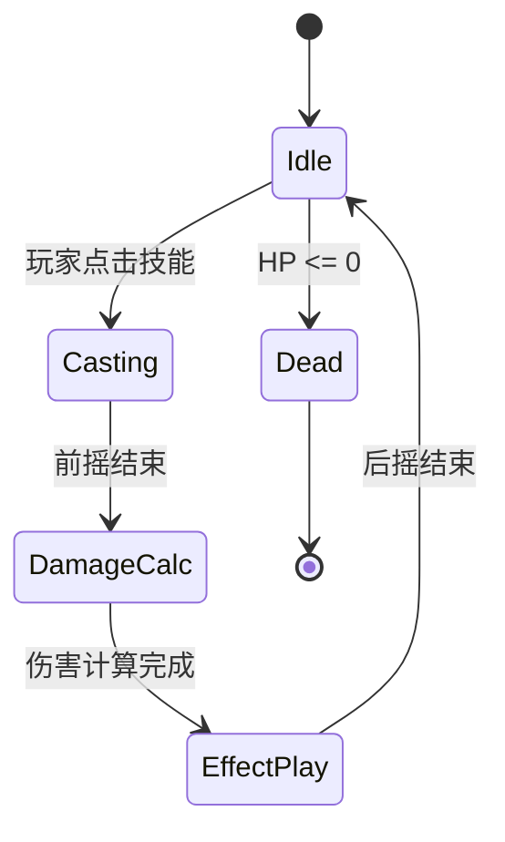

# Harness Pipeline → H5 游戏研发框架 完整改造方案

> **版本**: 1.0.0-draft
> **日期**: 2026-05-06
> **范围**: 在保持原 `harness-pipeline` 仓库不变的前提下，新建 `game-pipeline` 仓库，为 H5/Web 游戏研发提供适配的 AI 协作编排框架。
> **适用类型**: H5/Web 游戏（Cocos Creator / Phaser / PixiJS / Three.js 技术栈）

---

## 一、改造总览

### 1.1 改造原则

1. **原仓库不变**：`harness-pipeline` 保持原样继续服务 Web 业务软件开发
2. **最大复用**：不改的部分直接引用原仓库文件（通过 init.sh 远程拉取），只在新仓库中维护改动/新增的文件
3. **最小侵入**：所有改动都通过文件级替换或新增实现，不修改原框架的协议层（任务 YAML schema、Agent 协议格式等）
4. **引擎中立**：客户端的代码生成 Skill 保持抽象，通过"引擎适配层"映射到具体引擎格式

### 1.2 Skill 层变化总览

```
原框架 11 个 Skill：
  analyze / architect / design-ui / code-go / code-frontend
  test / review / entropy / pipeline / modular-vibe-coding / contract-sync

改造后 18 个 Skill：

  保留 (4)：    code-go / review_go / entropy / modular-vibe-coding
  改造 (6)：    analyze → analyze-game
               architect → architect-game
               design-ui → design-game-ui
               test → test-game
               pipeline → pipeline-game
               contract-sync → protocol-sync
  新增 (8)：    design-gameplay   （Gameplay 系统设计）
               balance           （数值设计）
               generate-assets   （AI 美术资产生成）
               pack-assets       （资源打包与引擎导出）
               code-game-client  （客户端代码）
               code-scene        （场景/UI DSL 生成）
               review-game       （游戏专项审查）
               build-game        （构建与分包）
```

### 1.3 流水线阶段变化

```
原 Web 流水线：
  analyze → architect → design-ui → module-plan → code → test → review → PR

改造后 H5 游戏流水线：
  analyze-game → GDD 确认 → architect-game → design-game-ui → 审批
    → 核心原型（白模验证）→ 人类试玩确认
    → design-gameplay（各系统设计）→ balance（数值生成）
    → 并行：
        ├─ generate-assets（美术资产）→ pack-assets
        ├─ code-game-client + code-scene（客户端）
        └─ code-go（服务端）
    → protocol-sync（协议对齐）
    → 联调集成
    → test-game（跑图/回放/数值验证）
    → review-game（帧预算/DrawCall/内存）
    → build-game（构建/分包/CDN）
    → 上线
```

---

## 二、新仓库目录结构

```
game-pipeline/
├── AGENTS.md                     # Agent Team 总调度（从原仓库复制 + 游戏章节）
├── CLAUDE.md                     # Claude Code 执行指令（从原仓库复制 + 游戏分支判断）
├── AGENTS.override.md            # 本地覆盖配置（从原仓库复制）
├── dashboard.html                # 流水线仪表盘（从原仓库复制，后续可替换为游戏特化版）
├── .gitignore                    # 从原仓库复制
│
├── skills/                       # Skill 定义（核心改动区）
│   ├── analyze-game/SKILL.md     # 改造：GDD 分析
│   ├── architect-game/SKILL.md   # 改造：游戏架构设计
│   ├── design-game-ui/SKILL.md   # 改造：游戏 UI/HUD 设计
│   ├── design-gameplay/SKILL.md  # 新增：Gameplay 系统设计
│   ├── balance/SKILL.md          # 新增：数值设计与验证
│   ├── generate-assets/SKILL.md  # 新增：AI 美术资产生成
│   ├── pack-assets/SKILL.md      # 新增：资源打包与格式转换
│   ├── code-game-client/SKILL.md # 新增：客户端 TypeScript 代码
│   ├── code-scene/SKILL.md       # 新增：场景/预制体 DSL 生成
│   ├── code-go/SKILL.md          # 保留（从原仓库引用）
│   ├── test-game/SKILL.md        # 改造：游戏测试
│   ├── review-game/SKILL.md      # 新增：游戏专项审查
│   ├── review/SKILL.md           # 保留（从原仓库引用，Go 代码审查）
│   ├── protocol-sync/SKILL.md    # 改造：协议一致性检查
│   ├── build-game/SKILL.md       # 新增：构建/分包/部署
│   ├── entropy/SKILL.md          # 保留（从原仓库引用）
│   ├── pipeline-game/SKILL.md    # 改造：游戏流水线编排
│   └── modular-vibe-coding/SKILL.md  # 保留（从原仓库引用）
│
├── docs/
│   ├── templates/                # 文档模板（新增游戏类）
│   │   ├── gdd.md                # 新增：游戏设计文档模板
│   │   ├── gameplay-system.md    # 新增：Gameplay 系统设计文档模板
│   │   ├── balance-table.md      # 新增：数值配置表模板
│   │   ├── level-design.md       # 新增：关卡设计文档模板
│   │   ├── protocol.md           # 新增：协议文档模板（替代 openapi.yaml）
│   │   ├── asset-manifest.md     # 新增：资产清单模板
│   │   ├── prb.md                # 保留（从原仓库引用，项目管理用）
│   │   ├── architecture.md       # 改造（从原仓库复制 + 游戏章节）
│   │   ├── requirement.md        # 改造
│   │   ├── module-plan.md        # 改造
│   │   └── ui-spec.md            # 改造
│   │
│   ├── references/               # 编码规范
│   │   ├── go-conventions.md     # 保留（从原仓库引用）
│   │   ├── game-client-conventions.md  # 新增：游戏客户端编码规范
│   │   ├── scene-dsl-spec.md     # 新增：场景 DSL 规范
│   │   ├── asset-naming-convention.md  # 新增：资产命名与目录规范
│   │   ├── balance-conventions.md      # 新增：数值设计规范
│   │   └── ci-cd.md              # 保留（从原仓库引用）
│   │
│   ├── design-docs/
│   │   ├── adr/README.md         # 保留
│   │   └── architecture.md       # 保留（参考架构，从原仓库复制）
│   │
│   ├── plans/
│   │   └── game-pipeline-adaptation-plan.md  # 本文档
│   │
│   ├── modules/_index.md         # 保留（从原仓库复制）
│   ├── requirements/.gitkeep     # 保留
│   ├── api-specs/.gitkeep        # 保留（游戏里改名为 proto/）
│   ├── design-specs/.gitkeep     # 保留
│   └── ui-prototypes/.gitkeep    # 保留
│
├── engine-adapters/              # 引擎适配层（新增核心目录）
│   ├── README.md                 # 适配层使用说明
│   ├── cocos-creator/            # Cocos Creator 适配
│   │   ├── dsl-to-scene.ts       # DSL → Cocos .scene JSON
│   │   ├── dsl-to-prefab.ts      # DSL → Cocos .prefab JSON
│   │   ├── dsl-to-animation.ts   # DSL → Cocos .anim JSON
│   │   └── asset-import.ts       # 资产导入脚本
│   ├── phaser/                   # Phaser 适配
│   │   ├── dsl-to-scene.ts       # DSL → Phaser Scene 代码
│   │   └── asset-import.ts       # 资产导入脚本
│   ├── pixijs/                   # PixiJS 适配
│   │   ├── dsl-to-scene.ts
│   │   └── asset-import.ts
│   └── threejs/                  # Three.js 适配（3D H5）
│       ├── dsl-to-scene.ts
│       └── asset-import.ts
│
├── scripts/
│   ├── init.sh                   # 改造：游戏项目初始化脚本
│   ├── run-prototype.sh          # 新增：快速原型启动脚本
│   ├── balance-validate.sh       # 新增：数值验证脚本
│   ├── protocol-sync.sh          # 改造：协议一致性检查
│   └── build-game.sh             # 新增：构建脚本
│
├── internal/domain/.gitkeep      # 保留（占位）
└── src/.gitkeep                  # 保留（占位）
```

---

## 三、Skill 改造详细设计

### 3.1 `/analyze-game` — GDD 分析

**改造自**：`/analyze`

**核心变化**：
- 输入不再是"产品需求"，而是**游戏概念描述**（核心循环、目标体验、参考游戏）
- 产出不再是 PRB，而是**GDD 摘要文档**
- 新增产物：**核心循环流程图**（用 Mermaid 描述玩家 → 挑战 → 奖励 → 成长的闭环）

**产出路径**：`docs/requirements/<game>-gdd-summary.md`

**SKILL.md 关键指令**：

```
## 模式：游戏 GDD 分析

### 输入解析
从用户描述中提取：
1. 核心循环：玩家做什么 → 遇到什么挑战 → 获得什么奖励 → 如何变强
2. 游戏类型（放置/卡牌/三消/塔防/弹幕/...）→ 确定基础机制模板
3. 参考游戏：用户提到的对标游戏
4. 目标平台：H5 浏览器 / 微信小游戏 / 抖音小游戏 / 多端
5. 美术风格方向：像素/扁平/二次元/写实/极简

### 产出结构
1. 游戏概述（一句话 + 一段话 + 核心卖点 3 条）
2. 核心循环图（Mermaid flow）
3. 玩家旅程（首次体验 → 日常 → 付费 → 社交）
4. 系统清单（列出所有需要的 Gameplay 系统，标注优先级 P0/P1/P2）
5. 美术资产预估（角色数、场景数、UI 面板数、特效数）
6. 技术风险标注（多人在线同步 / 复杂物理 / 大量动画 / AI 行为）
7. 验收标准（能玩的标准是什么——MVP 最少需要哪些系统可用）
```

---

### 3.2 `/architect-game` — 游戏架构设计

**改造自**：`/architect`

**核心变化**：
- 产出两份文档：**客户端架构** + **服务端架构**（而非单一全局架构）
- 产出 **协议设计文档** + **Proto 文件**（替代 OpenAPI）
- 新增：**帧预算估算**（主界面、战斗、特效场景各预估 FPS）
- 新增：**引擎选型建议**（基于游戏类型和复杂度）

**产出路径**：
- `docs/design-docs/architecture.md` — 全局架构（包含客户端 + 服务端 + 网络模型）
- `docs/proto/<service>.proto` — 协议定义文件
- `docs/design-docs/frame-budget.md` — 帧预算文档

**SKILL.md 关键指令**：

```
## 模式：游戏架构设计

### 设计维度

#### A. 客户端架构
- 引擎选型（Cocos / Phaser / PixiJS / Three.js）及理由
- 渲染管线（场景图 → 剔除 → 排序 → 绘制）
- 资源加载策略（预加载 / 按需加载 / 分包策略）
- 场景管理（启动 → 主菜单 → 核心玩法 → 结算 的状态机）
- Gameplay 框架（ECS 还是 GameObject 组件模式）
- UI 管理（弹窗栈 / 层级管理 / 分辨率适配方案）

#### B. 服务端架构
- 网络模型：HTTP（非实时） / WebSocket 长连接 / 帧同步 / 状态同步
- 房间管理：创建/加入/离开/断线重连
- 数据持久化：玩家数据 / 排行榜 / 战斗记录
- 反作弊策略：客户端校验 + 服务端权威校验 + 行为分析

#### C. 协议设计
- 主协议格式：Protobuf / JSON / FlatBuffers（推荐 Protobuf）
- 消息路由设计：消息 ID 分配表
- 时序约定：请求-响应 / 服务端推送 / 广播 的 proto 结构约定
- 协议兼容性规则：字段增删的语义约定（如新增字段必须有默认值）

#### D. 模块划分
- 客户端模块清单（按系统：战斗 / 背包 / 商城 / 社交 / 任务）
- 服务端模块清单（按 Domain：玩家 / 房间 / 匹配 / 排行榜 / 支付）
- 模块依赖图与 Wave 划分

#### E. 帧预算（必须）
| 场景 | 目标 FPS | 单帧预算 | DrawCall 上限 | 内存上限 |
|------|---------|---------|--------------|---------|
| 主菜单 | 60 | 16ms | 20 | 50MB |
| 核心玩法 | 30 | 33ms | 50 | 80MB |
| 特效密集 | 25 | 40ms | 30 | 80MB |

#### 产出物
- 全局架构文档（含客户端 + 服务端 + 网络模型 + 模块划分 + 帧预算）
- Proto 协议文件（至少包含 login、room、gameplay 三类消息）
```

---

### 3.3 `/design-game-ui` — 游戏 UI/HUD 设计

**改造自**：`/design-ui`

**核心变化**：
- 不再产出 HTML 原型，改为产出 **UI 布局 DSL** + **HUD 规范文档**
- 适配多分辨率方案（固定宽度 / 固定高度 / 等比缩放 / 安全区）
- 产出**游戏 UI 组件清单**（面板、弹窗、按钮、列表、进度条、标签页）
- 每个 UI 组件的**规格描述**（尺寸、Anchor、9-slice 区域、交互反馈）

**产出路径**：
- `docs/design-specs/game-ui-spec.md` — HUD 规范
- `docs/ui-prototypes/<scene>.ui.yaml` — UI 布局 DSL

**SKILL.md 关键指令**：

```
## 模式：游戏 UI 设计

### 输出
1. HUD 规范文档（字体、颜色、面板风格、弹窗模板、动画曲线）
2. 每个界面的 UI 布局 DSL（YAML 格式，引擎无关）：
   - 画布分辨率与适配策略
   - 组件树（层级、Anchor、尺寸、引用资源名）
   - 交互逻辑标注（点击 → 打开哪个面板 / 发送什么协议）

### UI DSL 示例（引擎无关）
```yaml
scene: MainMenu
canvas:
  width: 750
  height: 1334
  fitMode: fixedWidth
layers:
  - name: Background
    components:
      - type: Image
        name: bg_main
        anchor: [0.5, 0.5]
        size: [750, 1334]
        sprite: bg_main_menu
  - name: UI
    components:
      - type: Button
        name: btn_start
        anchor: [0.5, 0.6]
        size: [300, 80]
        sprite_normal: btn_start_n
        sprite_pressed: btn_start_p
        action: navigate_to_game_mode_select
      - type: Text
        name: title
        anchor: [0.5, 0.3]
        fontSize: 48
        text: "游戏标题"
```

---

### 3.4 `/design-gameplay` — Gameplay 系统设计（新增）

**职责**：将 GDD 中的机制描述转化为可编码的**系统设计文档**。

**产出路径**：`docs/design-docs/<system-name>.md`（每个 Gameplay 系统一份）

**SKILL.md 关键指令**：

```
## 输入
- GDD 摘要中标注的 P0/P1 系统清单
- 全局架构中的 Gameplay 框架选型

## 为每个系统产出

### 1. 系统概述
- 职责边界（这个系统管什么、不管什么）
- 与其他系统的交互接口

### 2. 状态机设计（Mermaid state diagram）
- 所有状态枚举
- 状态转换条件
- 进入/退出状态的回调

### 3. 数据模型
- 运行时数据结构（TypeScript interface）
- 序列化/反序列化规则（用于断线重连恢复）

### 4. 接口定义
- 对外暴露的公共方法签名
- 对外发出的事件/通知

### 5. 配置表结构
- 策划可调的参数列表（填入数值表中）

### 6. 实现要点
- 关键算法伪代码（如战斗伤害计算、AI 决策树）
- 性能注意事项（如大量单位时的更新策略）

## 示例产出：战斗系统设计
```

```
```

---

### 3.5 `/balance` — 数值设计与验证（新增）

**职责**：从设计目标反向计算数值配置，并验证数值合理性。

**产出路径**：
- `docs/balance/<system>.csv` — 数值配置表
- `docs/balance/balance-report.md` — 数值验证报告

**SKILL.md 关键指令**：

```
## 输入
- GDD 中的体验目标（如"玩家打同级怪需要 3-5 次攻击"）
- Gameplay 系统设计中的配置表结构

## 核心流程

### 1. 确立数值锚点
- 确定基础参数（如一级角色攻击力 A₁、一级怪物血量 H₁）
- 确立体验目标（如 N 级打同级怪耗时 T_N、升级耗时 D_N）

### 2. 反向计算曲线
- 从体验目标反向推导属性成长函数
- 常见曲线模板：线性、二次、指数型（前快后慢）、对数型（前慢后快）

### 3. 生成配置表
- 输出 CSV/JSON 格式的数值表
- 每列标注：参数名 / 最小值 / 最大值 / 设计意图 / 验证公式

### 4. 自动验证
- 模拟战斗：随机抽取同等级角色 vs 怪物，验证击杀次数分布
- 经济平衡：验证收入 vs 消耗是否在目标范围内
- 极端值检查：最高等级属性是否溢出、最低等级是否可玩

### 5. 敏感度分析
- 标注"高风险参数"（变化 10% 就会导致体验显著偏移的参数）
- 给出安全调节范围

## 产出物
- 数值配置表（CSV，策划可直接导入游戏）
- 验证报告（包含模拟结果图表数据，可用 HTML 渲染）
```

---

### 3.6 `/generate-assets` — AI 美术资产生成（新增）

**职责**：根据美术风格描述，生成游戏所需的全部美术资产，并进行一致性校验。

**产出路径**：
- `assets/raw/<category>/` — 原始资产
- `docs/design-specs/asset-manifest.md` — 资产清单与风格锚点

**SKILL.md 关键指令**：

```
## 阶段一：风格锚定

1. 用户提供 1-3 张参考图，或文字描述风格
2. 确定风格常量：
   - 线条风格：无线条 / 细线条 / 粗描边
   - 上色方式：平涂 / 渐变 / 像素
   - 透视：正交（2D）/ 等距（2.5D）/ 透视（3D）
   - 角色比例：Q版（2-3头身）/ 正常（5-7头身）/ 写实
   - 调色板：主色 / 辅色 / 强调色（Hex 值列表）
3. 生成一份"风格参考卡"（HTML 展示：色板 + 线条样本 + 角色比例示意 + 示例图标）
4. 人类确认风格参考卡

## 阶段二：逐类资产生成

### 2.1 角色
- 输入：角色描述列表（名称、外观特征、默认姿势）
- 生成：每个角色 ①默认立绘 ②表情变体 ③战斗姿势
- 一致性：同一角色的所有资产共享 Seed + ControlNet 参考

### 2.2 UI 组件
- 输入：UI 布局 DSL 中引用的组件名列表
- 生成：按钮（normal/pressed/disabled）、面板背景、图标、进度条部件
- 要求：遵循风格参考卡的色板和线条规范

### 2.3 特效帧
- 输入：特效描述（如"爆炸效果、64x64、16帧、红橙色系"）
- 生成：逐帧 PNG 序列
- 校验：相邻帧像素差异平滑度检查

### 2.4 场景背景
- 输入：场景描述列表（如"草原白天、黑暗洞穴、雪山顶"）
- 生成：分层背景（远景天空层 + 中景建筑层 + 近景地面层）
- 要求：各层边缘透明，支持视差滚动

## 阶段三：一致性校验

### 3.1 角色一致性
- 逐角色计算：同一角色不同资产的 CLIP 相似度
- 低于阈值（建议 0.85）→ 标记为"偏离"，退回重生成

### 3.2 UI 风格一致性
- 检查所有 UI 组件的色板是否符合风格参考卡
- 检查按钮/面板的圆角、阴影参数是否统一

### 3.3 动画流畅度
- 计算相邻帧的像素变化率
- 突变帧（变化率 > 标准差 3 倍）→ 标记为"抖动"

### 3.4 资产清单生成
- 汇总所有资产：名称、路径、尺寸、格式、所属类别、关联角色/场景
```

---

### 3.7 `/pack-assets` — 资源打包与引擎导出（新增）

**职责**：将原始资产转换为引擎可用的格式，生成图集和资源清单。

**产出路径**：
- `assets/packed/` — 打包后的资产
- `assets/manifest.json` — 引擎资源清单

**SKILL.md 关键指令**：

```
## 流程

### 1. 精灵图集打包
- 扫描 assets/raw/sprites/ 下所有 PNG
- 使用 MaxRects 算法打包为图集（最大 2048x2048）
- 输出：atlas.png + atlas.json（每帧的 x/y/w/h/rotated 信息）
- 约束：单个图集文件不超过 2MB（H5 加载性能要求）

### 2. 格式优化
- PNG → WebP（质量 85%，文件约减少 40%）
- 音频：WAV → MP3（128kbps）/ OGG（112kbps）
- 保留原始格式作为备份

### 3. 引擎格式导出
- 根据项目选用的引擎，调用对应的 engine-adapters/<engine>/asset-import.ts
- 生成引擎特定的资源清单格式：
  - Cocos：生成 .meta 文件 + 资源数据库更新
  - Phaser：生成 preload 场景代码
  - PixiJS：生成 Assets manifest

### 4. 资产清单更新
- 更新 assets/manifest.json（所有资产的路径、格式、尺寸、所属图集、加载优先级）
```

---

### 3.8 `/code-game-client` — 客户端 TypeScript 代码（新增）

**职责**：产出游戏的 TypeScript 源码，组织为场景、实体、系统、UI 的模块结构。

**产出路径**：`src/` 下的游戏源码

**SKILL.md 关键指令**：

```
## 编码规范

遵从 `docs/references/game-client-conventions.md`：
1. 场景类继承引擎基类（如 Phaser.Scene / cc.Component）
2. Gameplay 系统使用纯 TypeScript 类（引擎无关），通过适配器连接引擎 API
3. 网络层独立封装（WebSocket 连接管理 + Proto 编解码）
4. UI 组件使用工厂模式创建，加载自 UI DSL 描述

## 模块结构
src/
├── scenes/          # 场景文件（每个场景一个文件）
├── gameplay/        # Gameplay 系统（战斗/技能/AI/任务/背包）
├── entities/        # 游戏实体（角色/怪物/NPC/道具）
├── ui/              # UI 组件工厂 + 面板逻辑
├── network/         # WebSocket 客户端 + 消息队列 + 断线重连
├── config/          # 数值配置（从 /balance 产出的 CSV 转换而来）
└── utils/           # 工具函数（对象池/事件总线/计时器）

## 与场景 DSL 的协作
- /code-scene 产出场景 DSL → engine-adapter 转换为引擎场景文件
- /code-game-client 产出场景类的逻辑代码（挂载到场景节点上的脚本）
- 场景逻辑代码通过引用 DSL 中定义的节点名来关联对象
```

---

### 3.9 `/code-scene` — 场景/UI DSL 生成（新增）

**职责**：基于 `/architect-game` 的场景清单和 `/design-game-ui` 的 UI 布局 DSL，生成引擎格式的场景文件。

**产出路径**：
- `scenes/<name>.scene.yaml` — 场景 DSL
- `engine-adapters/<engine>/` — 转换后的引擎格式文件

**SKILL.md 关键指令**：

```
## 输入
- 场景清单（来自 architect-game）
- UI 布局 DSL（来自 design-game-ui）
- Gameplay 系统设计文档（需要哪些实体/触发器放在场景里）

## 流程

### 1. 生成场景 DSL（引擎无关 YAML）
- 场景基础信息（Canvas 尺寸、适配模式）
- 节点树（层级、Transform、引用组件）
- 预制体引用（角色/怪物/NPC 从 prefab 实例化）
- 碰撞体/触发器放置
- 光照/后处理配置

### 2. 调用引擎适配器转换
- 根据项目 `docs/design-docs/architecture.md` 中的引擎选型
- 调用 `engine-adapters/<engine>/dsl-to-scene.ts`
- 生成目标引擎的场景文件

### 3. 验证
- 检查生成的文件体积（单场景 < 500KB 为宜）
- 检查引用的资源路径是否存在
```

---

### 3.10 `/test-game` — 游戏测试（改造自 `/test`）

**改造自**：`/test`

**核心变化**：不再产出表驱动单元测试，改为三种游戏专用测试模式。

**SKILL.md 关键指令**：

```
## 三种测试模式

### A. 协议级回放测试
- 流程：录制一局操作序列（协议消息序列 + 时间戳）→ 回放 → 比对状态
- 适用：战斗系统、技能系统、回合制逻辑
- 通过标准：回放后的关键状态数据（HP/位置/技能冷却）与录制时完全一致

### B. 自动跑图 Bot
- 使用无头浏览器（Puppeteer/Playwright）运行游戏
- Bot 执行预定义路径（注册 → 登录 → 进关卡 → 战斗 → 结算 → 回主城）
- 运行 N 遍（建议 ≥ 100 遍）
- 通过标准：零崩溃、关键路径帧率不低于目标值、无网络超时

### C. 数值 A/B 验证
- 从 /balance 产出的配置表中取参数
- 模拟 N 场战斗（N ≥ 10000）
- 验证：实际战斗时长分布是否在设计目标区间内
- 验证：掉落概率的实际分布与配置概率的偏差是否在 5% 以内

## 产出
- `.harness/reports/test-report.md`（包含跑图统计、回放比对结果、数值分布图）
```

---

### 3.11 `/review-game` — 游戏专项审查（新增）

**职责**：在 `/review`（Go 代码审查）之外，增加游戏特有的审查维度。

**SKILL.md 关键指令**：

```
## 审查维度

### 1. 帧预算审查（硬门控）
- 检查每个场景的 DrawCall 数量是否在设计上限内
- 检查是否有每帧创建对象的行为（应在初始化时创建，运行时复用对象池）
- 检查 Update/Tick 方法中是否有 O(n²) 或以上的算法

### 2. 内存审查
- 检查场景切换后旧场景资源是否释放
- 检查事件监听器是否在销毁时注销
- 检查是否有循环引用导致 GC 无法回收

### 3. 资源加载审查
- 检查是否有同步加载阻塞主线程
- 检查首场景加载的资源量是否超出帧预算文档中的上限

### 4. Phase 1 完整性核对（从原框架继承）
- 读取 Gameplay 系统设计文档的 Implementation Phases 表
- 逐项确认 Phase 1 每个功能是否已实现
- Noop/Stub 必须有 TODO 注释说明替代方案和目标 Phase
```

---

### 3.12 `/protocol-sync` — 协议一致性检查（改造自 `contract-sync`）

**改造自**：`contract-sync`

**核心变化**：检查 Proto ↔ 客户端解析 ↔ 服务端 handler 三端一致性。

**SKILL.md 关键指令**：

```
## 检查维度

### 1. Proto → 客户端
- Proto 定义的每条消息是否在客户端有对应的 decode 函数
- 客户端引用的消息 ID 是否都在 Proto 中有定义
- 新增/删除字段的兼容性：
  - 新增字段必须有默认值
  - 删除字段保留 tag number 标记为 reserved

### 2. Proto → 服务端
- Proto 定义的消息 ID 是否在服务端 router 中注册
- 服务端 handler 的请求/响应类型是否与 Proto 定义一致

### 3. 协议时序
- 检查关键流程的协议时序是否与 `docs/design-docs/architecture.md` 中的时序图一致
- 如：login → enter_room → room_ready → frame_data → game_over 的顺序和依赖

## 通过标准
- 三端消息 ID 一致
- 无未注册的 handler
- 无客户端不处理的响应消息
- 关键时序路径可追踪
```

---

### 3.13 `/build-game` — 构建与部署（新增）

**职责**：执行游戏构建、分包、CDN 部署。

**SKILL.md 关键指令**：

```
## 构建流程

### 1. 编译
- 客户端：TypeScript → JavaScript（tsc + webpack/vite bundle）
- 服务端：Go build

### 2. 分包（H5 必需）
- 引擎代码单独打包（vendor.js，用户浏览器可缓存）
- 首场景资源打包为首包（< 5MB）
- 后续场景按需分包（每个场景独立加载）

### 3. 资源处理
- 非首包资源添加 MD5 hash 文件名（支持长期缓存）
- 生成资源版本清单（用于热更新对比）

### 4. CDN 部署
- 静态资源上传至 CDN（阿里云 OSS / 腾讯云 COS）
- HTML 入口文件部署到 Web 服务器

### 5. 验证
- 部署后自动打开无头浏览器检查：
  - 首屏加载时间 < 3s
  - 引擎初始化正常
  - 首场景渲染正常
  - 无 JS 报错
```

---

### 3.14 `/pipeline-game` — 游戏流水线编排（改造自 `/pipeline`）

**改造自**：`/pipeline`

**核心变化**：
- 流水线阶段完全替换（见第四节）
- 新增"原型试玩确认"审批节点
- 新增"美术风格确认"审批节点
- Wave 划分逻辑调整：客户端内部有更明确的依赖链，不是简单拓扑排序

**SKILL.md 关键指令**：

```
## 游戏流水线阶段

### 项目级（新游戏 / 大型资料片）

1. /analyze-game → 产出 GDD 摘要
2. ⏸ 人类确认 GDD
3. /architect-game → 产出客户端+服务端架构、协议设计、帧预算
4. ⏸ 人类审批架构
5. /design-game-ui → 产出 HUD 规范 + UI 布局 DSL
6. ⏸ 人类审批 UI 规范
7. 核心原型构建（快速白模搭建）
8. ⏸ 人类试玩确认（原型是否好玩、核心循环是否成立）
9. /design-gameplay → 逐系统产出系统设计文档
10. /balance → 产出数值配置表 + 验证报告
11. ⏸ 人类确认数值（可通过模拟器直观感受数值）
12. 模块分解 → 产出执行计划
13. ⏸ 人类确认执行计划
── 并行开发阶段 ──
14. 美术资产管线：/generate-assets → ⏸ 风格确认 → /pack-assets
15. 客户端开发：/code-game-client + /code-scene（并行）
16. 服务端开发：/code-go
── 集成阶段 ──
17. /protocol-sync → 协议一致性检查
18. 联调集成
19. /test-game → 跑图/回放/数值验证
20. /review → Go 代码审查
21. /review-game → 游戏专项审查（帧预算/内存/DrawCall）
22. ⏸ 人类确认测试与审查结论
── 发布阶段 ──
23. /build-game → 构建/分包/CDN 部署
24. 上线后监控

### 模块级（单系统迭代）
1. /analyze-game（模块上下文）→ 产出单系统需求
2. ⏸ 确认
3. /design-gameplay → 系统设计
4. /balance → 数值更新
5. → code → test → review → 集成 → 上线
```

---

## 四、流水线阶段详细对比

### 4.1 项目级流水线

```
原 Web 框架：
  需求 → /analyze(PRB) → ⏸ → /architect(全局) → ⏸ → /design-ui(全局规范) → ⏸
  → 模块分解 → ⏸ → Wave 串行设计 → 全局对齐校验 → ⏸
  → Wave 串行编码 → PR

H5 游戏框架：
  游戏概念 → /analyze-game(GDD) → ⏸
  → /architect-game(客户端+服务端+协议+帧预算) → ⏸
  → /design-game-ui(HUD规范+UI DSL) → ⏸
  → 核心原型(白模) → ⏸ 人类试玩确认  ← 关键新增节点
  → /design-gameplay(逐系统设计) → /balance(数值) → ⏸
  → 模块分解(Wave划分) → ⏸
  ─ 并行开发 ─
  → 美术管线: /generate-assets → ⏸ 风格确认 → /pack-assets
  → 客户端: /code-game-client + /code-scene
  → 服务端: /code-go
  ─ 集成 ─
  → /protocol-sync → 联调 → /test-game → /review + /review-game → ⏸
  → /build-game → 上线
```

### 4.2 审批节点对比

| 原框架审批节点 | 游戏框架对应 | 变化 |
|-------------|------------|------|
| PRB 确认 | GDD 确认 | 产出物从产品需求变为游戏设计文档 |
| 全局架构审批 | 架构审批（含帧预算） | 审批维度增加性能约束 |
| 全局设计规范审批 | HUD 规范审批 | 从 Web 设计规范变为游戏 UI 规范 |
| 执行计划确认 | 同 | 模块划分逻辑变化 |
| 设计对齐确认 | 设计对齐 + 数值验证 | 增加数值合理性确认 |
| — | **原型试玩确认** | 新增：必须试玩通过才能继续 |
| — | **美术风格确认** | 新增：资产管线启动前必须确认风格 |

---

## 五、文档模板改造

### 5.1 GDD 模板摘要

```markdown
# GDD：{游戏名称}

## 1. 游戏概述
- 一句话描述
- 核心卖点（3 条）
- 参考游戏与差异化
- 目标平台与分辨率

## 2. 核心循环
```mermaid
[玩家核心行为循环图]
```

## 3. 玩家旅程
- 首次体验（Day 1）
- 日常循环（Day N）
- 付费转化路径
- 社交/传播路径

## 4. 系统清单
| 系统 | 优先级 | 简述 | 依赖系统 |
|------|--------|------|---------|
| 战斗 | P0 | 回合制/即时 → 核心伤害公式 | 角色属性 |
| 角色养成 | P0 | 升级/装备/技能树 | 战斗（校验数值） |
| 背包 | P0 | 道具管理 | 无 |
| 商城 | P1 | 道具购买 | 背包 |
| 任务 | P1 | 日常/主线/成就 | 战斗、背包 |

## 5. 美术风格方向
- 风格关键词
- 参考作品
- 角色风格描述
- UI 风格描述
- 调色板方向

## 6. 技术约束
- 加载时间上限（首屏 < 3s）
- 帧率下限（核心玩法 > 30fps）
- 兼容性要求（iOS Safari / 微信内置浏览器 / Android Chrome）
- 是否需要多人/实时同步

## 7. MVP 定义
- 最少需要哪些系统可用，玩家可以开始玩
- 玩家可以从头到尾走通的"最小完整流程"
```

### 5.2 Gameplay 系统设计模板

```markdown
# {系统名称} 系统设计

## 1. 系统职责
- 管什么
- 不管什么（明确排除）

## 2. 内部状态机
```mermaid
[状态转换图]
```

## 3. 对外接口
### 公共方法
| 方法 | 参数 | 返回值 | 说明 |
|------|------|--------|------|

### 事件通知
| 事件 | 携带数据 | 触发时机 |

## 4. 运行时数据结构
```typescript
interface XxxState {
  // ...
}
```

## 5. 配置表
| 参数 | 类型 | 默认值 | 说明 |
|------|------|--------|------|

## 6. 关键算法伪代码

## 7. Implementation Phases（强制）
| Phase | 优先级 | 功能清单 | 验收标准 | 依赖 |
|-------|--------|---------|---------|------|
| 1 | P0 | | | |
| 2 | P1 | | | Phase 1 |
| 3 | P2 | | | Phase 2 |
```

### 5.3 数值配置表模板

```markdown
# {系统名称} 数值配置

## 1. 体验目标
| 目标 | 描述 | 量化指标 |
|------|------|---------|
| 同级战斗时长 | 1 级角色打 1 级怪 | 3-5 次攻击，耗时 8-15 秒 |
| 升级速度 | 1→10 级 | 总游戏时间 2-4 小时 |

## 2. 基础参数（锚点）
| 参数 | 1 级值 | 公式 | 说明 |
|------|--------|------|------|
| 攻击力 | 100 | — | 基础锚点参数 |
| 怪物血量 | 500 | — | 使 1 级战斗约 5 次攻击完成 |

## 3. 成长曲线
| 等级 | 攻击力 | 防御 | 血量 | 经验 |
|------|--------|------|------|------|
| 1 | 100 | 20 | 1000 | 0 |
| 2 | 115 | 23 | 1100 | 200 |
| ... | ... | ... | ... | ... |
| 100 | ... | ... | ... | ... |

## 4. 掉落表
| 怪物 ID | 道具 ID | 概率 | 数量范围 | 备注 |
|---------|--------|------|---------|------|

## 5. 敏感度分析
| 参数 | 安全调节范围 | 风险 |
|------|------------|------|
| 攻击力成长系数 | ±15% | 超过 +20% 则同级怪变为秒杀 |

## 6. 验证结果
- 模拟战斗 10000 次，击杀次数分布：[直方图]
- 偏差：实际耗时均值 12.3s（目标 8-15s）✅
```

### 5.4 协议文档模板

```protobuf
// 协议版本
syntax = "proto3";

// 消息 ID 分配
// 1000-1099: 系统消息（登录/心跳/错误）
// 1100-1199: 房间相关
// 1200-1299: 战斗相关
// 1300-1399: 社交相关
// ...按系统分配 ID 段

// === 系统消息 ===
message LoginReq {
  string token = 1;
  string device_id = 2;
}

message LoginResp {
  int32 code = 1;         // 0=成功
  string message = 2;
  PlayerInfo player = 3;
}

// === 消息路由 ===
// | 消息 ID | 方向 | 消息类型 | 说明 |
// | 1000 | C→S | LoginReq | 登录请求 |
// | 1001 | S→C | LoginResp | 登录响应 |
```

---

## 六、架构与模块划分变化

### 6.1 客户端模块划分（游戏专用）

```
客户端架构（以 Cocos Creator 为例）：
src/
├── core/
│   ├── Game.ts              # 游戏主循环入口
│   ├── SceneManager.ts      # 场景切换（加载/卸载/过渡动画）
│   ├── ResourceLoader.ts    # 资源加载器（预加载/按需加载/释放）
│   └── ObjectPool.ts        # 通用对象池
├── gameplay/
│   ├── battle/              # 战斗系统
│   │   ├── BattleManager.ts       # 战斗主控
│   │   ├── DamageSystem.ts        # 伤害计算（读取 balance 配置）
│   │   ├── SkillSystem.ts         # 技能释放
│   │   └── AISystem.ts            # AI 行为
│   ├── inventory/           # 背包系统
│   ├── quest/               # 任务系统
│   └── growth/              # 养成系统
├── ui/
│   ├── UIManager.ts         # UI 栈管理（开/关/返回/层级）
│   ├── panels/              # 各面板逻辑
│   │   ├── MainMenuPanel.ts
│   │   ├── BattleHUD.ts
│   │   └── ShopPanel.ts
│   └── components/          # 可复用的 UI 组件
│       ├── GameButton.ts
│       └── ProgressBar.ts
├── network/
│   ├── WSClient.ts          # WebSocket 客户端（连接/心跳/重连）
│   ├── MessageCodec.ts      # Proto 编解码
│   └── MessageRouter.ts     # 消息分发到各系统
├── audio/
│   └── AudioManager.ts      # 音效/音乐管理
├── config/
│   ├── balance/             # 从 /balance 产出的 CSV 转换而来
│   └── GameConfig.ts        # 游戏全局配置
└── utils/
    ├── EventBus.ts          # 跨系统事件通信
    └── TimerManager.ts      # 计时器管理
```

### 6.2 依赖方向（游戏专用）

```
Gameplay 系统 → 配置层(balance)  ← 只读引用，不修改
Gameplay 系统 → 事件总线(EventBus)  ← 跨系统通信的唯一方式
UI 层 → Gameplay 系统  ← 只调用公共方法、不直接改状态
网络层 → Gameplay 系统  ← 通过事件总线派发协议消息
核心层(core) → 被所有层依赖（场景管理、对象池、资源加载）

禁止：
✗ Gameplay 系统之间直接调用（必须通过 EventBus）
✗ UI 层直接修改 Gameplay 状态
✗ 任何层直接操作渲染节点（必须通过引擎封装）
```

---

## 七、质量门控对比

| # | 门控 | 原框架 | 游戏框架 | 类型 |
|---|------|--------|---------|------|
| 1 | GDD 确认 | PRB 确认 | GDD 确认 | 人类审批 |
| 2 | 架构审批 | 含错误码/OAPI规范 | +帧预算 +引擎选型 +网络模型 | 人类审批 |
| 3 | UI 规范审批 | Web 设计规范 | HUD 规范 + UI DSL | 人类审批 |
| 4 | **原型试玩** | — | 白模原型可玩性验证 | **新增 人类审批** |
| 5 | **美术风格确认** | — | 风格参考卡确认 | **新增 人类审批** |
| 6 | 数值确认 | —（无对应） | 数值模拟验证 + 敏感度分析 | **新增 人类审批** |
| 7 | 协议同步 | API 契约一致性 | Proto ↔ 客户端 ↔ 服务端 三端一致 | 自动检查 |
| 8 | 测试通过 | 单元测试 + API 测试 | 跑图 100 局 + 回放测试 + 数值验证 | 硬门控 |
| 9 | 帧预算审查 | — | DrawCall / 内存 / GC 压力 | **新增 硬门控** |
| 10 | 代码审查 | Go 分层合规 | Go 分层 + 游戏专项（帧预算/资源释放/对象池） | 软门控 |
| 11 | 构建验证 | go build + npm build | 多平台构建 + 首屏加载 < 3s + 首包 < 5MB | **新增 自动检查** |

---

## 八、引擎适配层设计

### 8.1 场景 DSL 规范（引擎无关）

```yaml
# scene-dsl.yaml — 引擎无关的场景描述格式
scene:
  name: BattleScene
  canvas:
    width: 750
    height: 1334
    fitMode: fixedWidth  # fixedWidth | fixedHeight | showAll | noBorder
  backgroundColor: [0.1, 0.1, 0.15, 1.0]  # RGBA

layers:
  - name: Background
    order: 0
    nodes:
      - type: Sprite
        id: bg_battlefield
        position: [375, 667]
        size: [750, 1334]
        texture: bg_battlefield_01
        parallax: [0.02, 0.02]  # 视差系数

  - name: GameObjects
    order: 1
    nodes:
      - type: Prefab
        id: player_spawn
        prefab: characters/hero_knight
        position: [200, 600]
      - type: Prefab
        id: enemy_spawn_point
        prefab: characters/enemy_slime
        position: [550, 600]

  - name: UI
    order: 10
    nodes:
      - type: Prefab
        id: battle_hud
        prefab: ui/hud_battle
        position: [0, 0]
```

### 8.2 适配器接口

每个引擎适配器需要实现以下接口：

```typescript
// engine-adapters/interface.ts
interface EngineAdapter {
  // 场景转换
  convertScene(dsl: SceneDSL): EngineSceneFile;
  
  // 预制体转换
  convertPrefab(dsl: PrefabDSL): EnginePrefabFile;
  
  // 动画转换
  convertAnimation(dsl: AnimationDSL): EngineAnimationFile;
  
  // 资产导入
  importAsset(asset: RawAsset): EngineAssetMeta;
  
  // 图集导入
  importAtlas(atlas: PackedAtlas): EngineAtlasMeta;
}
```

---

## 九、实施路径

### 第一阶段：核心 Skill 定义（优先级最高）

| # | 任务 | 产出 | 预估 |
|---|------|------|------|
| 1 | 创建 `game-pipeline` 仓库骨架 | 目录结构 + init.sh | 0.5d |
| 2 | 编写 `analyze-game/SKILL.md` | GDD 分析 Skill | 1d |
| 3 | 编写 `architect-game/SKILL.md` | 游戏架构 Skill | 1d |
| 4 | 编写 `pipeline-game/SKILL.md` | 游戏的 AGENTS.md + CLAUDE.md | 1d |
| 5 | 编写所有文档模板 | `docs/templates/game-*` (7 个) | 1d |

### 第二阶段：设计层 + 资产管线

| # | 任务 | 产出 | 预估 |
|---|------|------|------|
| 6 | `design-gameplay/SKILL.md` + `design-game-ui/SKILL.md` | 两个设计 Skill | 1.5d |
| 7 | `balance/SKILL.md` | 数值设计 Skill | 1d |
| 8 | `generate-assets/SKILL.md` + `pack-assets/SKILL.md` | 美术资产管线 | 1.5d |
| 9 | 资产命名规范文档 | `asset-naming-convention.md` | 0.5d |

### 第三阶段：编码层 + 引擎适配器

| # | 任务 | 产出 | 预估 |
|---|------|------|------|
| 10 | `code-game-client/SKILL.md` + `code-scene/SKILL.md` | 编码 Skill | 1d |
| 11 | 场景 DSL 规范文档 | `scene-dsl-spec.md` | 0.5d |
| 12 | Cocos Creator 适配器 | `engine-adapters/cocos-creator/` | 2d |
| 13 | Phaser 适配器 | `engine-adapters/phaser/` | 1d |

### 第四阶段：质量层 + 构建

| # | 任务 | 产出 | 预估 |
|---|------|------|------|
| 14 | `test-game/SKILL.md` + `review-game/SKILL.md` + `protocol-sync/SKILL.md` | 质量 Skill | 1.5d |
| 15 | `build-game/SKILL.md` | 构建 Skill | 1d |
| 16 | 端到端验证（用一个简单的放置类游戏做全流水线测试） | 验证报告 | 2d |

**总计**：约 18 人天

---

## 十、与原框架的复用关系

以下文件从原 `harness-pipeline` 仓库直接复用（不修改）：

```
复用文件列表（通过 init.sh 远程拉取或本地复制）：
├── .gitignore
├── dashboard.html
├── skills/code-go/SKILL.md
├── skills/review/SKILL.md
├── skills/entropy/SKILL.md
├── skills/modular-vibe-coding/SKILL.md
├── docs/templates/prb.md（项目管理用）
├── docs/templates/requirement.md
├── docs/references/go-conventions.md
├── docs/references/ci-cd.md
├── docs/design-docs/architecture.md（参考架构）
└── docs/modules/_index.md
```

以下文件从原仓库复制后修改：
```
├── AGENTS.md              → 新增游戏角色与阶段
├── CLAUDE.md              → 新增游戏流水线分支判断
├── scripts/init.sh        → 新增游戏目录结构
└── scripts/contract_sync.sh → 改造为 protocol-sync.sh
```

---

## 附录：术语映射表

| 原框架术语 | 游戏框架对应 | 说明 |
|-----------|------------|------|
| PRB（产品需求文档） | GDD（游戏设计文档） | 产品需求 → 游戏设计 |
| 模块 | 系统 | 如"订单模块" → "战斗系统" |
| OpenAPI | Proto 协议文件 | REST API → Protobuf 消息 |
| contract-sync | protocol-sync | API 契约 → 协议一致性 |
| HTML 原型 | 白模原型 + UI DSL | Web 原型 → 游戏可玩原型 |
| 全局设计规范 | HUD 规范 + UI DSL | 配色/排版 → 图集/适配/层级 |
| 单元测试 | 回放测试 + 跑图 | 函数级 → 帧级/协议级 |
| 代码审查 | 代码审查 + 帧预算审查 | 分层合规 + 性能合规 |
| K8s 部署 | CDN + OSS 部署 | 容器部署 → 静态资源分发 |
| Docker build | Webpack/Vite bundle | 镜像构建 → JS bundle |
